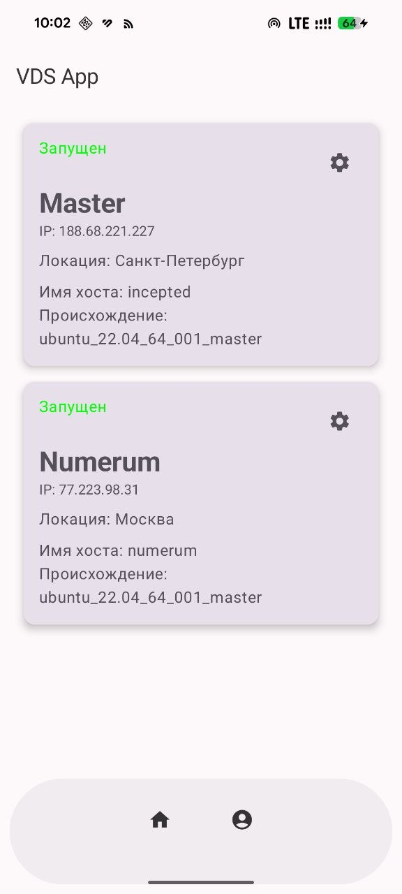

[🇷🇺 Русский](README_RU.md)

# Selectel VDS Client

## About the project
Unofficial Android client for managing servers [Selectel VDS](https://vds.selectel.ru). An application based on Jetpack Compose that allows you to work with rented servers directly from your phone. Created for educational purposes.

## Purpose of creation
A personal project for practicing native Android development on Kotlin with Jetpack Compose, as well as for convenient access to your Selectel servers from a mobile device.

## Current Status
The project is under development. Implemented:
- Authorization using API token
- View profile information
- List of servers

## How to launch
1. Open the project in Android Studio
2. Build and run on an emulator or device
3. To log in you will need an API token from your Selectel personal account

## License
MIT. See file [LICENSE](LICENSE).