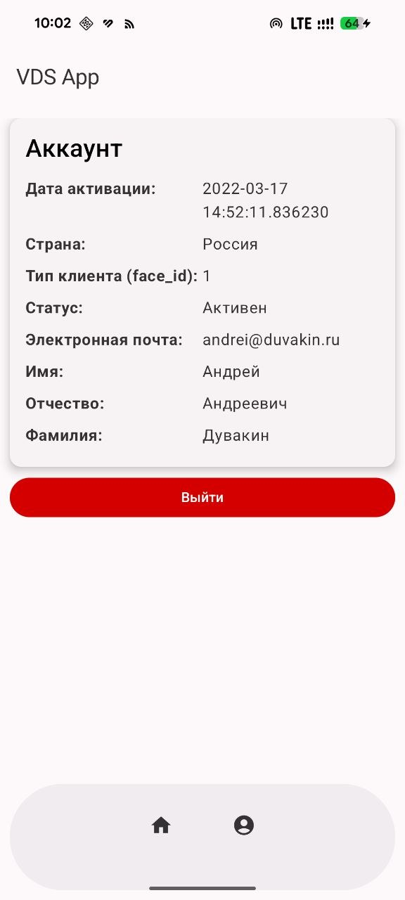

[🇬🇧 English](README.md)

# Selectel VDS Client

## О проекте
Неофициальный Android-клиент для управления серверами [Selectel VDS](https://vds.selectel.ru). Приложение на Jetpack Compose, позволяющее работать с арендованными серверами прямо с телефона. Создан в учебных целях.

## Цель создания
Личный проект для практики нативной Android-разработки на Kotlin с Jetpack Compose, а также для удобного доступа к своим серверам Selectel с мобильного устройства.

## Текущее состояние
Проект в разработке. Реализовано:
- Авторизация по API-токену
- Просмотр информации о профиле
- Список серверов

## Как запустить
1. Открыть проект в Android Studio
2. Собрать и запустить на эмуляторе или устройстве
3. Для входа потребуется API-токен из личного кабинета Selectel

## Лицензия
MIT. См. файл [LICENSE](LICENSE).